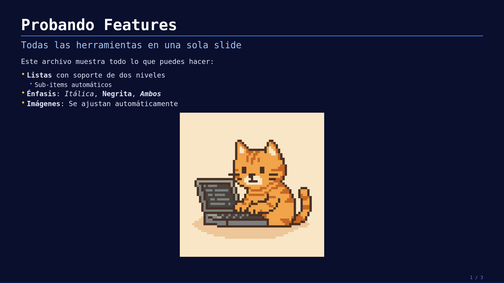
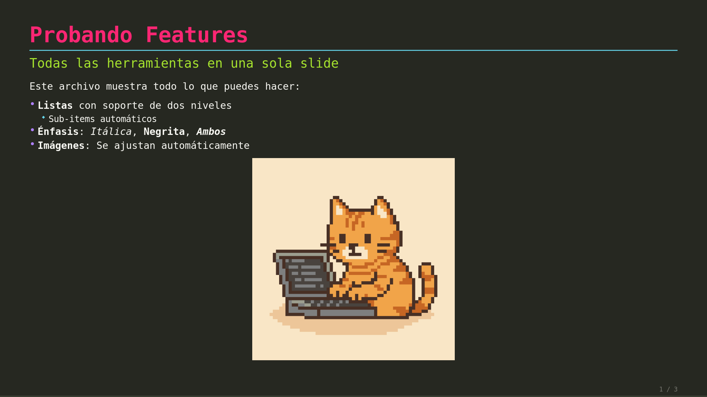
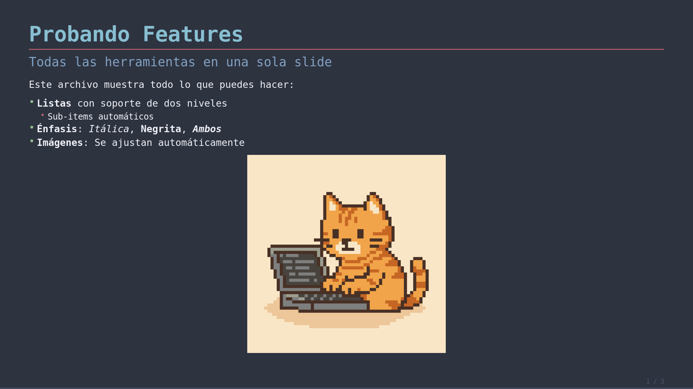
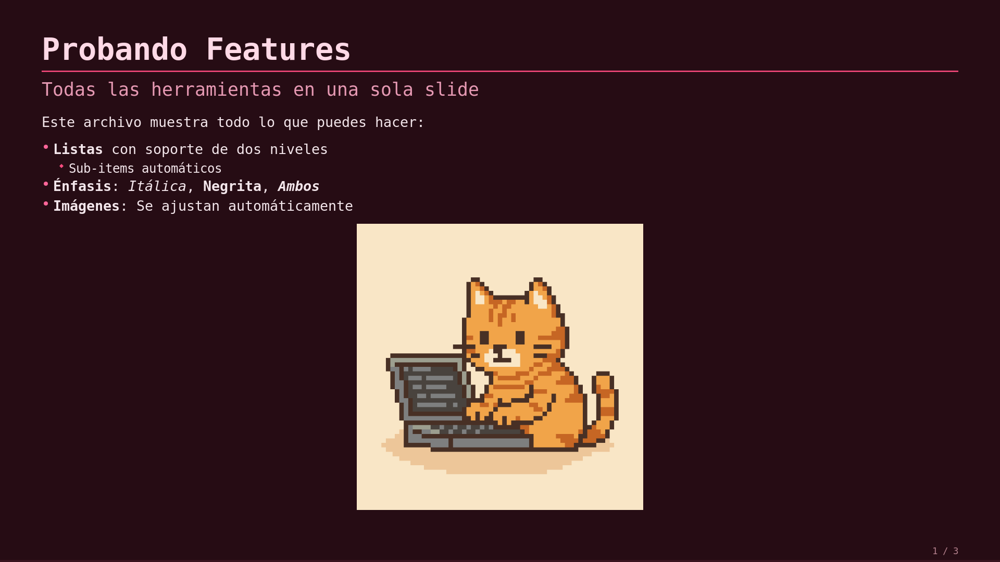
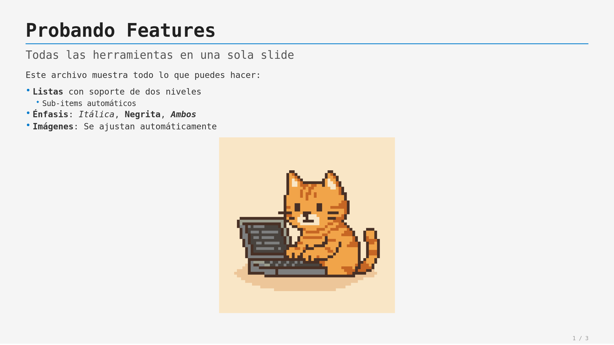

# C-Slides 🛝

Un presentador de diapositivas minimalista y de alto rendimiento escrito en **C** utilizando **X11**, **Cairo** y **Pango**. Diseñado para renderizar archivos Markdown directamente en pantalla con una estética moderna y profesional.

## Previsualización de Estilos

Aquí puedes ver cómo luce el mismo slide con diferentes paletas de colores (Renderizado a 1080p):

| Dark (Default) | Monokai | Nord |
| :---: | :---: | :---: |
|  |  |  |

| Rose | Light |
| :---: | :---: |
|  |  |

## Arquitectura del Proyecto

El proyecto ha sido refactorizado para separar las responsabilidades y permitir la portabilidad de sus componentes a múltiples lenguajes (**Ada, Dart, Python, Zig, Lua, Go**):

- `slider.h`: API pública (Firmas de funciones para facilitar el porting).
- `src/core/`: Lógica del Parser y estructuras de datos internas.
- `src/render/`: Motor de dibujo basado en Cairo/Pango (soporta Markup y Anti-aliasing).
- `src/ui/`: Gestión de ventanas X11 y loop de eventos.

## Comparativa de Implementación (Markdown Spec)

La implementación actual sigue una filosofía orientada a **slides** (una línea = un elemento), lo que difiere del estándar CommonMark que es orientado a documentos de flujo continuo.

| Característica | Soporte | Detalle de Implementación |
| :--- | :---: | :--- |
| **Headers (#, ##)** | ✅ | Soporta niveles 1 y 2 con estilos diferenciados. |
| **Énfasis (Bold/Italic)** | ✅ | Implementado mediante Pango Markup (`**`, `__`, `*`, `_`). |
| **Listas (Bullets)** | ✅ | Soporta dos niveles (`-` y `  - `). |
| **Imágenes** | ✅ | Carga de PNGs con auto-escalado y cache. |
| **Tablas (GFM)** | ✅ | Renderizado completo con headers y filas alternas. |
| **Párrafos** | ✅ | Texto normal con soporte de wrapping automático. |
| **Blockquotes** | ✅ | Implementado con barra lateral acentuada y texto en color secundario. |
| **Código (Blocks/Inline)** | ✅ | Soporte de fuentes monoespaciadas y resaltado de sintaxis general (keywords, strings, symbols, comments). |
| **Enlaces [text](url)** | ❌ | No implementado (X11 no gestiona clicks en texto por defecto). |
| **Anidamiento Complejo** | ⚠️ | Limitado por el parser lineal; no soporta listas dentro de tablas. |

## Especificaciones Técnicas

- **Parser:** Lineal basado en prefijos (rápido, O(n)).
- **Rendering:** Sub-pixel precision con Cairo.
- **Tipografía:** Renderizado de fuentes del sistema vía Pango (default: Inter).
- **Performance:** Doble buffer para transiciones sin parpadeo (flicker-free).

## Uso

```bash
make
./slides [opciones] presentacion.md
```

**Opciones:**
- `-p, --palette <name>`: Elegir paleta (`dark`, `rose`, `monokai`, `nord`, `light`).
- `-f, --font-family <str>`: Definir tipografía (ej. 'Arial', 'JetBrains Mono').
- `-s, --font-scale <num>`: Escalar tamaño de fuentes (ej. 1.2).
- `-e, --export`: Exportar slides a archivos PNG.
- `-er, --export-res <WxH>`: Resolución de exportación (ej. 1920x1080).
- `-sl, --slide <num>`: Exportar solo una slide específica (0-index).
- `-v, --version`: Mostrar versión.
- `-h, --help`: Mostrar ayuda.

**Controles:**
- `->` / `Enter`: Siguiente diapositiva.
- `<-` / `Backspace`: Diapositiva anterior.
- `F`: Pantalla completa (Toggle).
- `Q` / `ESC`: Salir.

## Ports Disponibles

El proyecto incluye ports funcionales en los siguientes lenguajes:
- **Ada:** Localizado en `ada/`.
- **Dart:** Localizado en `dart/`.
- **Python:** Localizado en `python/`.
- **Zig:** Localizado en `zig/`.
- **Lua:** Localizado en `lua/`.
- **Go:** Localizado en `go/`.
