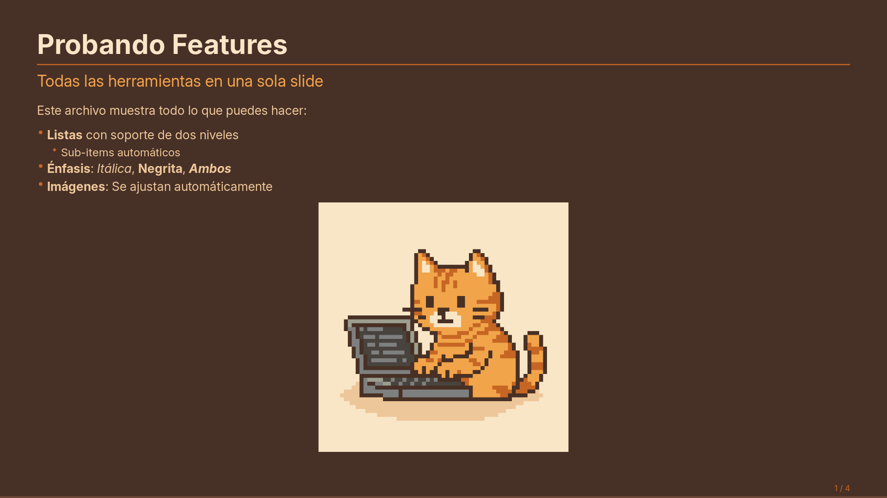
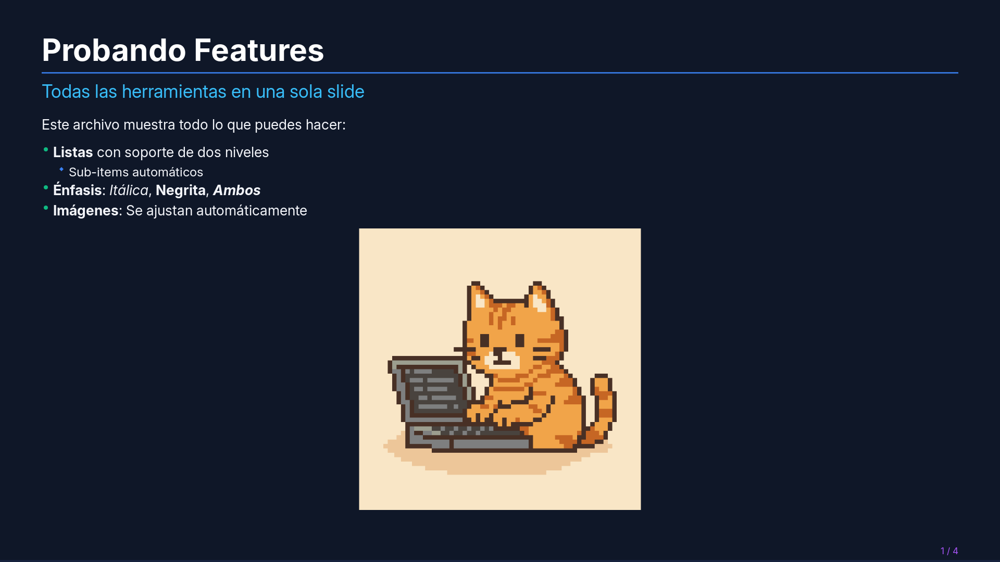
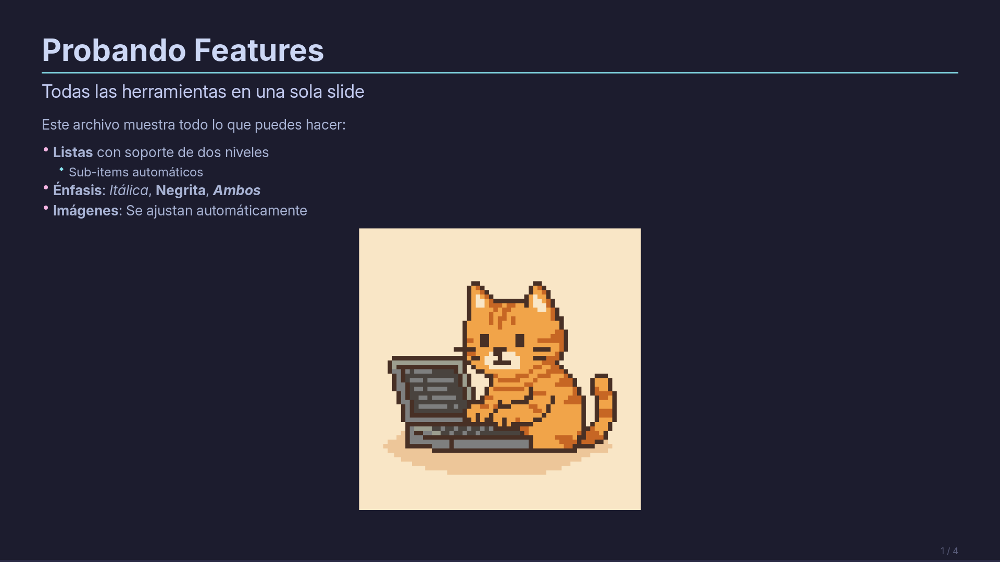
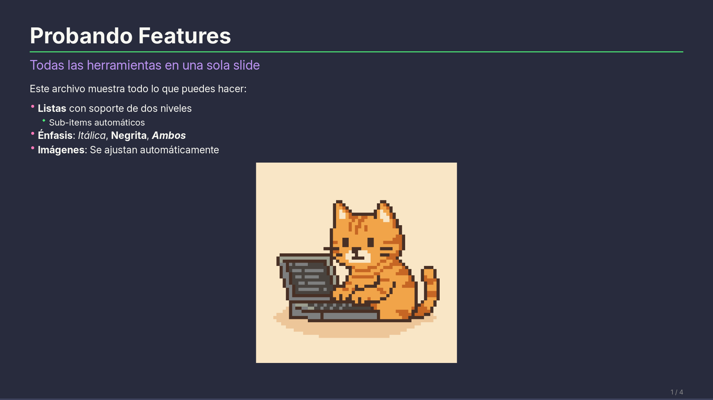
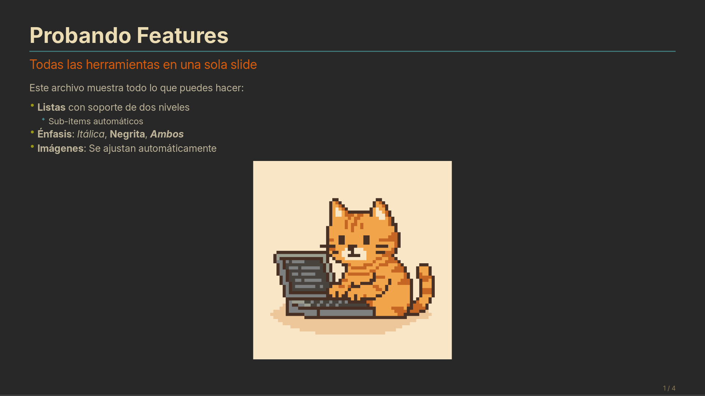
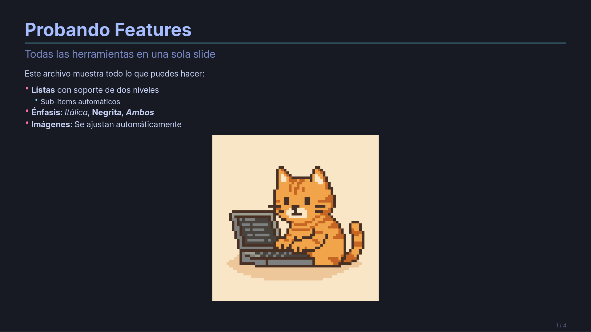

# C-Slides 🛝

Un presentador de diapositivas minimalista y de alto rendimiento escrito en **C** utilizando **X11**, **Cairo** y **Pango**. Diseñado para renderizar archivos Markdown directamente en pantalla con una estética moderna y profesional.

## Previsualización de Estilos

Aquí puedes ver cómo luce el mismo slide con diferentes paletas de colores (Renderizado a 1080p):

| Dark (Default) | Monokai |
| :---: | :---: |
|  |  |

| Nord | Rose |
| :---: | :---: |
|  |  |

| Light | Ambercat |
| :---: | :---: |
|  |  |

| Blue | Catppuccin |
| :---: | :---: |
|  |  |

| Dracula | Gruvbox |
| :---: | :---: |
|  |  |

| Tokyo Night | |
| :---: | :---: |
|  | |

## Arquitectura del Proyecto

El proyecto ha sido refactorizado para separar las responsabilidades y permitir la portabilidad de sus componentes a múltiples lenguajes (**Ada, Dart, Python, Zig, Lua, Go**):

- `slider.h`: API pública (Firmas de funciones para facilitar el porting).
- `src/core/`: Lógica del Parser y estructuras de datos internas.
- `src/render/`: Motor de dibujo basado en Cairo/Pango (soporta Markup y Anti-aliasing).
- `src/ui/`: Gestión de ventanas X11 y loop de eventos.

## Comparativa de Implementación (Markdown Spec)

La implementación actual sigue una filosofía orientada a **slides** (una línea = un elemento), optimizada para presentaciones dinámicas.

| Característica | Soporte | Detalle de Implementación |
| :--- | :---: | :--- |
| **Headers (#, ##)** | ✅ | Soporta niveles 1 y 2 con estilos diferenciados. |
| **Énfasis (Bold/Italic)** | ✅ | Implementado mediante Pango Markup (`**`, `__`, `*`, `_`). |
| **Listas (Bullets)** | ✅ | Soporta viñetas (`-` y `  - `). |
| **Listas Numeradas** | ✅ | **Nuevo:** Soporta `1.`, `a.`, `i)`, etc., con marcadores acentuados. |
| **Imágenes** | ✅ | Carga de PNGs/JPGs/GIFs con auto-escalado y cache. |
| **Tablas (GFM)** | ✅ | **Mejorado:** Ancho dinámico proporcional, ajuste de texto (wrap) y altura de fila variable. |
| **Párrafos** | ✅ | Texto normal con soporte de wrapping automático. |
| **Blockquotes** | ✅ | Implementado con barra lateral acentuada y texto en color secundario. |
| **Código (Blocks/Inline)** | ✅ | Soporte de fuentes monoespaciadas y resaltado de sintaxis general. |
| **Enlaces [text](url)** | ❌ | No implementado (X11 no gestiona clicks en texto por defecto). |

## Especificaciones Técnicas

- **Ancho Proporcional de Tablas:** Calcula el espacio basándose en el contenido de cada columna.
- **Renderizado Adaptativo:** Las filas de las tablas ajustan su altura según el contenido envuelto.
- **Tipografía:** Renderizado de fuentes del sistema vía Pango (default: Inter).
- **Performance:** Doble buffer para transiciones sin parpadeo (flicker-free).

## Uso

```bash
make
./slides [opciones] presentacion.md
```

**❯ slides --help**
```text
Uso: ./slides [opciones] presentacion.md

Opciones:
  -p, --palette <name>    Elegir paleta (dark, rose, monokai, nord, light, blue, ambercat,
                          dracula, gruvbox, catppuccin, tokyo-night)
  -f, --font-family <str> Definir tipografía (ej. 'Arial', 'JetBrains Mono')
  -s, --font-scale <num>  Escalar tamaño de fuentes (ej. 1.2)
  -e, --export <type>     Exportar slides a 'pdf' o 'png'
  -er, --export-res <WxH> Resolución de exportación (ej. 1920x1080, default 1080x1080)
  -sl, --slide <num>      Seleccionar slide específico para exportar (0-index)
  -h, --help              Mostrar esta ayuda
```

**Controles:**
- `->` / `Enter`: Siguiente diapositiva.
- `<-` / `Backspace`: Diapositiva anterior.
- `F`: Pantalla completa (Toggle).
- `Q` / `ESC`: Salir.

## Ports Disponibles

El proyecto incluye ports funcionales en los siguientes lenguajes:
- **Ada:** Localizado en `ada/`.
- **Dart:** Localizado en `dart/`.
- **Python:** Localizado en `python/`.
- **Zig:** Localizado en `zig/`.
- **Lua:** Localizado en `lua/`.
- **Go:** Localizado en `go/`.
