# C-Slides

Un presentador de diapositivas minimalista y de alto rendimiento escrito en **C** utilizando **Cairo** y **Pango**. Renderiza archivos Markdown directamente en pantalla con transiciones suaves, temas visuales y exportación a PNG/PDF/SVG/GIF/JPG.

## Previsualización

| Dark (Default) | Monokai |
| :---: | :---: |
| 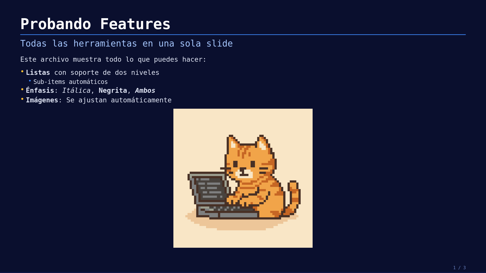 | 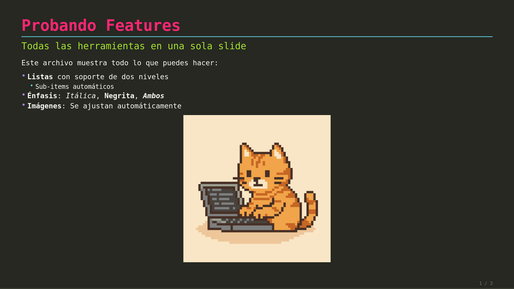 |

| Nord | Rose |
| :---: | :---: |
| 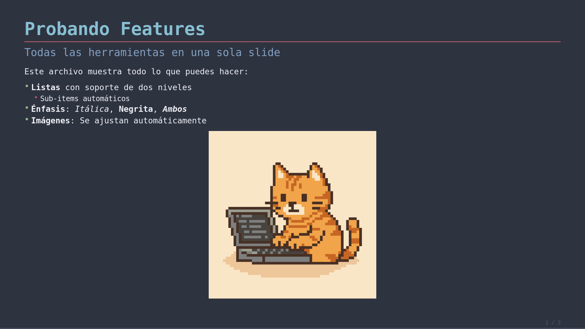 | 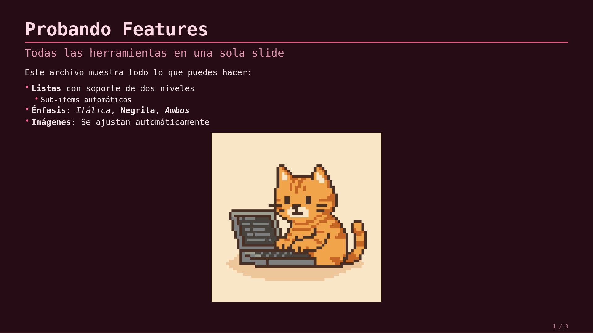 |

| Light | Ambercat |
| :---: | :---: |
| 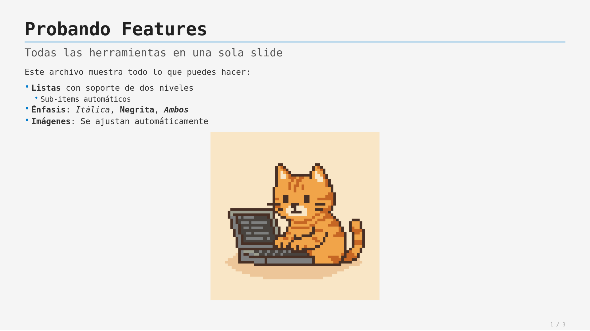 | 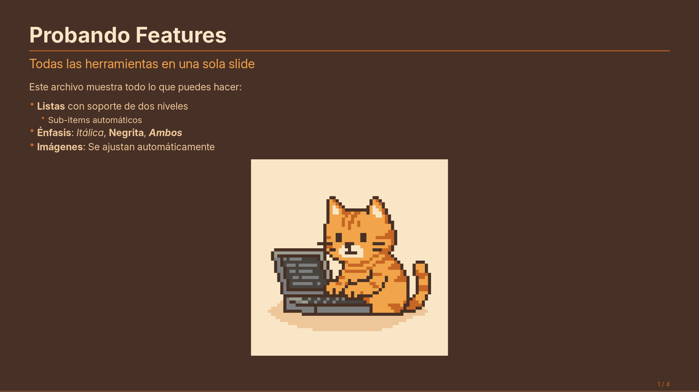 |

| Blue | Catppuccin |
| :---: | :---: |
| 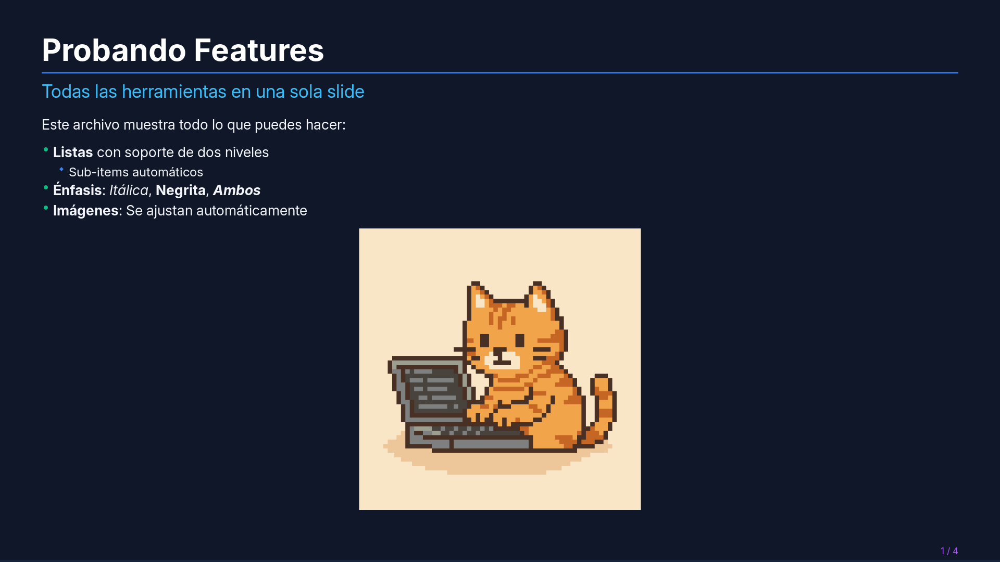 | 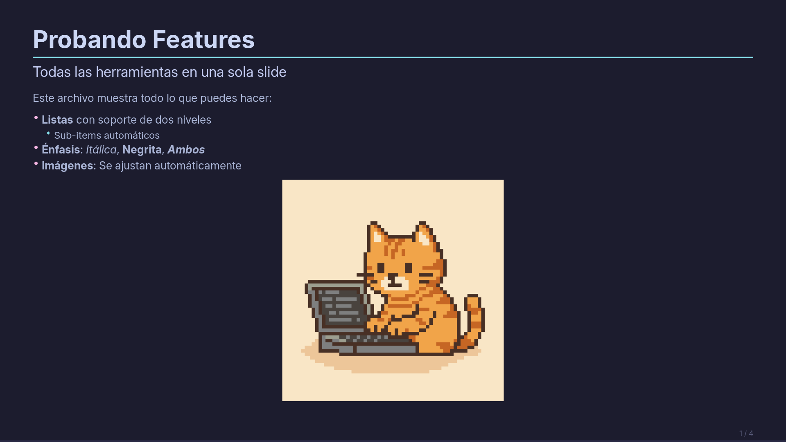 |

| Dracula | Gruvbox |
| :---: | :---: |
| 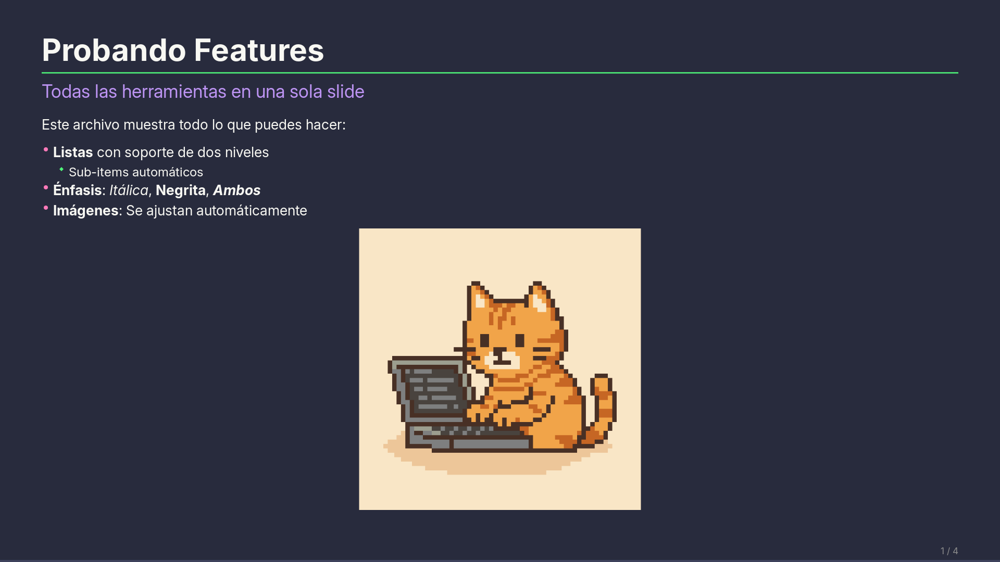 | 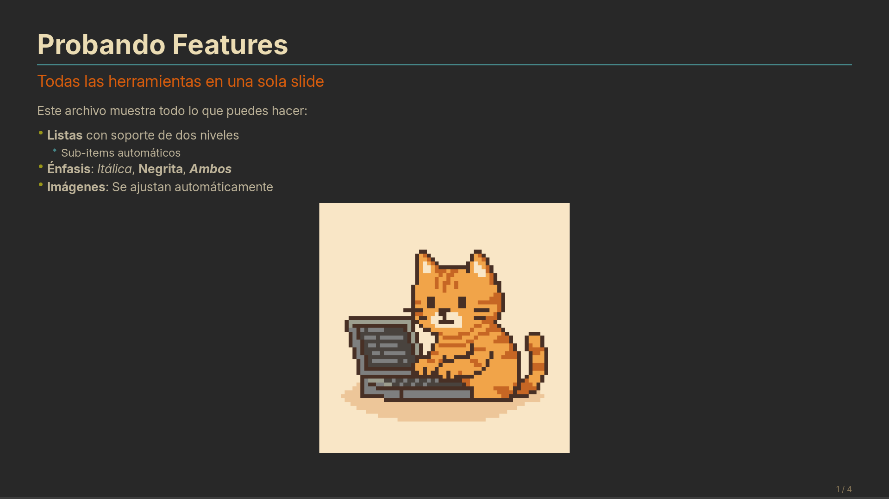 |

| Tokyo Night | |
| :---: | :---: |
| 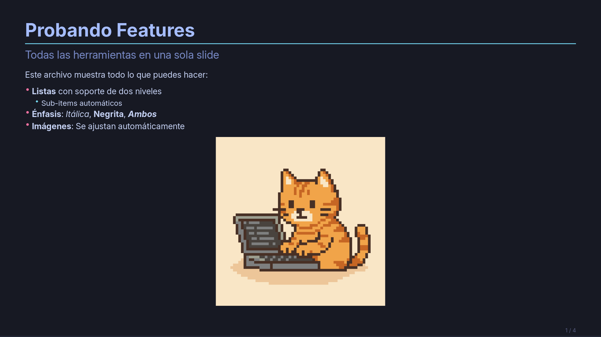 | |

## Características

### Contenido Markdown
- Títulos (`#`, `##`) con barra inferior decorativa
- Párrafos con word-wrapping automático
- Listas con viñetas (anidadas nivel 1 y 2)
- Listas numeradas (`1.`, `a)`, `i)`, etc.)
- Listas de tareas (`- [ ]` / `- [x]`)
- Blockquotes con barra lateral
- Imágenes PNG/JPG/GIF/BMP (auto-escalado, caché de 64 slots)
- Tablas con ancho proporcional, wrapping, filas alternadas y cabecera
- Bloques de código (fenced) con resaltado de sintaxis
- Códulo inline (`código`)
- Énfasis: **bold**, *italic*, ***combinado***

### Transiciones entre diapositivas
- `fade` — Fundido cruzado
- `slide-left` — Entrada desde la derecha
- `slide-right` — Entrada desde la izquierda
- `slide-up` — Entrada desde abajo
- `slide-down` — Entrada desde arriba
- `none` — Corte instantáneo
- Duración: 300ms con easing smoothstep
- Configurables por slide via `<!-- transition: tipo -->`

### Temas visuales (11 integrados)
| Tema | Descripción |
| :--- | :--- |
| `dark` | Fondo oscuro, texto blanco, acentos neutros |
| `rose` | Vino oscuro, acentos rosados |
| `monokai` | Vibrante, títulos rosados, viñetas verdes |
| `nord` | Azul-gris ártico, azules y verdes suaves |
| `light` | Fondo blanco, texto oscuro, acentos azules |
| `blue` | Pizarra azul profunda, acentos cielo |
| `ambercat` | Ámbar/marrón técnico |
| `dracula` | Púrpura/rosa/cian vibrante |
| `gruvbox` | Tono tierra retro |
| `catppuccin` | Pastel suave (mocha) |
| `tokyo-night` | Ciberpunk azul/rosa/cian |

### Frontmatter (metadatos YAML)
Configuración incrustada al inicio del archivo:
```markdown
---
theme: dracula
font: JetBrains Mono
scale: 1.2
colors:
  bg: "#0f0f23"
  title: "#ff6b6b"
  sub: "#a9b1d6"
  body: "#c0caf5"
  bullet: "#7dcfff"
  accent: "#7aa2f7"
  num: "#565f89"
  table-hdr: "#1a1b26"
  table-row: "#24283b"
  table-alt: "#1f2335"
  table-bdr: "#3b4261"
  code-bg: "#1a1b26"
  code-txt: "#c0caf5"
  code-kw: "#bb9af7"
  code-com: "#565f89"
  code-str: "#9ece6a"
  code-sym: "#f7768e"
---
```

### Notas del presentador
- `<!-- notes: texto -->` en una línea
- `<!-- notes:` ... `-->` multilinea
- Se imprimen automáticamente al navegar

### Hot reload
- Detecta cambios en el archivo `.md` cada 500ms
- Recarga automática preservando tema, fuente y escala
- Notificación en consola

### Exportación
- `--export png` — Exporta diapositivas a PNG (una por slide)
- `--export pdf` — Exporta todas las slides a un solo PDF
- `--export svg` — Exporta diapositivas a SVG (vectorial, una por slide)
- `--export gif` — Exporta todas las slides como GIF animado
- `--export jpg` / `--export jpeg` — Exporta diapositivas a JPEG (una por slide, calidad 90)
- `--export-res WxH` — Resolución personalizada (defecto: 1080x1080)
- `--slide N` — Seleccionar diapositiva específica (0-index, para png/svg/jpg)

### Backends de ventana
- **Win32** (Windows nativo) — GDI double-buffer, timer 60fps
- **X11** (Linux/BSD) — Doble buffer, framerate adaptativo
- Teclado, ratón, pantalla completa en ambos

## Requisitos

### Linux
```bash
sudo apt install libcairo2-dev libpango1.0-dev libx11-dev
```

### Windows (MSYS2 MinGW64)
Instala las dependencias desde la terminal MSYS2 (no PowerShell):
```
pacman -S mingw-w64-x86_64-cairo mingw-w64-x86_64-pango \
          mingw-w64-x86_64-gcc make
```

## Compilar

```bash
make
```

Esto produce:
- `slides` / `slides.exe` — Presentador interactivo
- `libslider.so` / `slider.dll` — Librería compartida (para ports FFI)
- `slides_ada` / `slides_ada.exe` — Versión Ada

En Windows, el Makefile auto-detecta MSYS2 (`C:/msys64/mingw64`, `C:/msys2/mingw64`).
Si usas Cygwin GCC, el Makefile muestra una advertencia.

## Uso

```bash
./slides [opciones] presentacion.md
```

En Linux, la documentación completa está disponible vía `man`:
```bash
man slides
```

### Opciones

| Flag | Descripción |
| :--- | :--- |
| `-p, --palette <nombre>` | Elegir tema (dark, rose, monokai, nord, light, ...) |
| `-f, --font-family <str>` | Tipografía (ej. 'Arial', 'JetBrains Mono') |
| `-s, --font-scale <num>` | Factor de escala (ej. 1.2) |
| `-e, --export <tipo>` | Exportar a 'pdf', 'png', 'svg', 'gif' o 'jpg' |
| `-er, --export-res <WxH>` | Resolución de exportación (ej. 1920x1080) |
| `-sl, --slide <num>` | Slide específico para exportar (0-index, para png/svg/jpg) |
| `--kiosk <sec>` | Avance automático cada N segundos (bucle infinito) |
| `--auto-advance <sec>` | Igual que --kiosk |
| `--bg`, `--title`, `--sub`, … | 17 colores vía CLI (ver [`docs/colors.md`](docs/colors.md)) |
| `-v, --version` | Versión |
| `-h, --help` | Ayuda |

Los argumentos CLI sobrescriben la configuración de frontmatter. La lista completa
de colores y su uso en frontmatter está en [`docs/colors.md`](docs/colors.md).

### Controles

| Tecla | Acción |
| :--- | :--- |
| `→` `Enter` `Space` `PageDown` | Siguiente diapositiva |
| `←` `Backspace` `PageUp` | Diapositiva anterior |
| `Home` | Primera diapositiva |
| `End` | Última diapositiva |
| `F` `F11` | Pantalla completa (toggle) |
| `Ctrl++` | Acercar (zoom in) |
| `Ctrl+-` | Alejar (zoom out) |
| `Ctrl+0` | Restablecer zoom |
| `Tab` | Vista general (mini-mapa de todas las slides) |
| `→` `←` `↑` `↓` `Enter` | Navegar y seleccionar en vista general |
| `Esc` | Salir / Cerrar vista general |
| `N` | Mostrar/ocultar número de slide y barra de progreso |
| `Q` | Salir |

Ratón: clic izquierdo/rueda-arriba = anterior, clic derecho/rueda-abajo = siguiente.

### Modo kiosk
`--kiosk N` avanza automáticamente a la siguiente diapositiva cada N segundos. Al llegar a la última, vuelve a la primera en bucle infinito. Ideal para vitrinas, displays públicos o ferias. La navegación manual resetea el contador.

```bash
./slides --kiosk 5 presentacion.md
./slides --auto-advance 10 presentacion.md
```

### Control de imágenes (`docs/images.md`)

La directiva `<!-- img: clave=valor, ... -->` permite controlar fit, tamaño,
opacidad, bordes redondeados, rotación y alineación de imágenes:

```markdown
<!-- img: fit=cover, opacity=0.5 -->

```

Ver la especificación completa en [`docs/images.md`](docs/images.md).

## Ejemplos

```bash
./slides examples/features.md
./slides examples/transitions.md
./slides examples/custom_colors.md
./slides --palette dracula examples/frontmatter.md
./slides examples/img_config.md
./slides --export pdf --export-res 1920x1080 presentacion.md
./slides --export gif presentacion.md
./slides --export jpg --export-res 1920x1080 presentacion.md
./slides --export svg --slide 0 presentacion.md
./slides -e png -sl 2 presentacion.md     # exporta solo slide 3 como PNG
```

## Arquitectura

```
slider.h              API pública
src/
  core/
    parser.c          Parser Markdown + frontmatter + transiciones
    themes.c          11 temas visuales
    highlighter.c     Resaltado de sintaxis genérico
    internal.h        Estructuras internas (Slide, Slider, Theme)
  render/
    renderer.c        Motor Cairo/Pango (solo slider_render)
    render_util.c     Utilidades de render + caché de imágenes
    render_table.c    Dibujado de tablas
    render_code.c     Bloques de código con syntax highlighting
    render_transition.c  Transiciones entre diapositivas
    export_png.c      Exportación a PNG
    export_jpg.c      Exportación a JPG
    export_pdf.c      Exportación a PDF
    export_gif.c      Exportación a GIF animado
    export_svg.c      Exportación a SVG
  ui/
    backend_win32.c   Ventana Win32 (nativa)
    backend_x11.c     Ventana X11
    help.c            Ayuda (--help / --version)
    help.h
    main.c            CLI + punto de entrada
```

## Tests

```bash
make test
```

Ejecuta 108 tests unitarios y de integración (Python + ctypes sobre `slider.dll`).

## Ports

El proyecto incluye bindings FFI funcionales en varios lenguajes:

- **Ada** (`ports/ada/`) — System.Address FFI, CLI completo
- **Dart** (`ports/dart/`) — dart:ffi + package:ffi
- **Python** (`ports/python/`) — ctypes + tests
- **Zig** (`ports/zig/`) — @cImport, Zig build system
- **Lua** (`ports/lua/`) — LuaJIT FFI
- **Go** (`ports/go/`) — cgo + flag package
